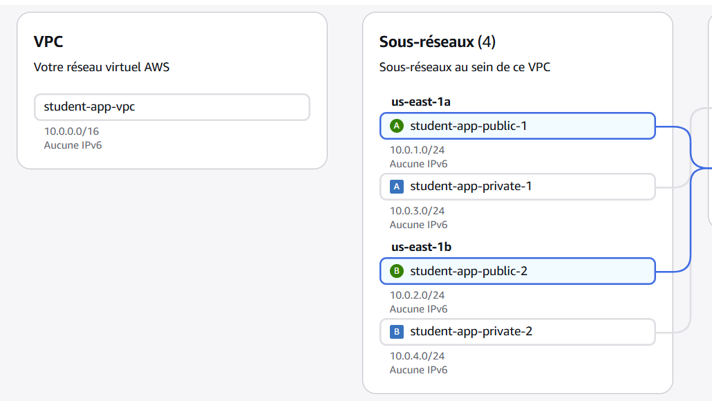
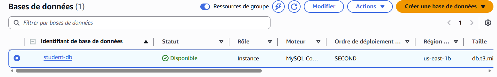
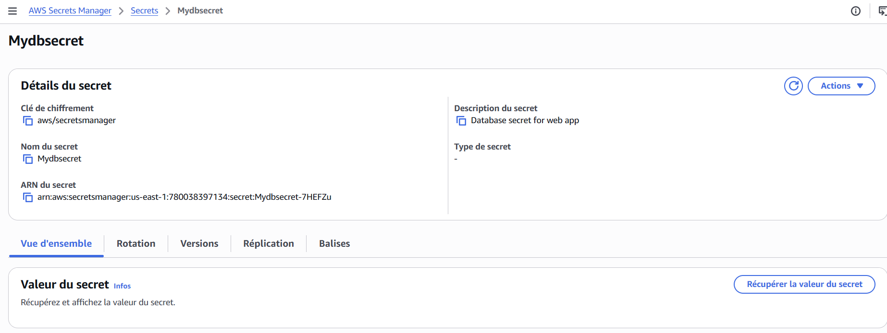
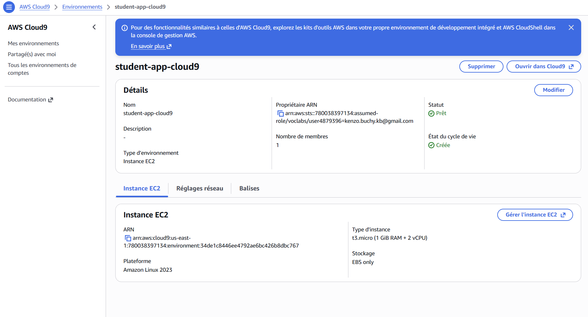
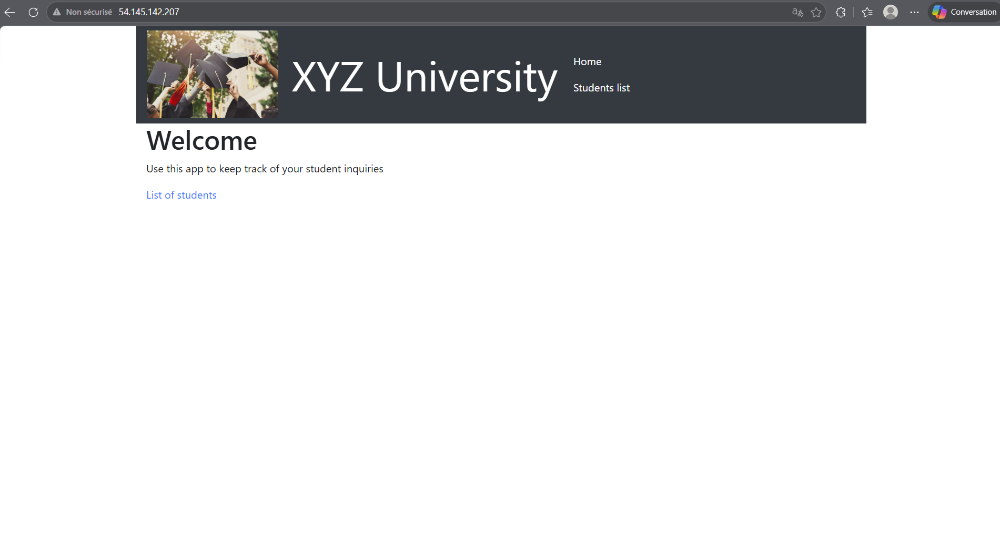

# Projet Final IaC — Université Exemple : Application de gestion des dossiers étudiants

**Auteurs :** Noa Brevet, Kenzo Buchy  
**Formation :** ESGI Master 2 — Infrastructure as Code  
**Cloud :** AWS (us-east-1)  
**Outil IaC :** Terraform

---

## Contexte

L'Université Exemple fait face à des problèmes de performance et de disponibilité de son application web de gestion des dossiers étudiants lors des pics d'admission. L'objectif est de migrer cette application vers AWS en suivant les bonnes pratiques du **AWS Well-Architected Framework**, en plusieurs phases progressives.

**Exigences clés de la solution :**
- Fonctionnelle (CRUD sur les dossiers étudiants)
- Hautement disponible et scalable
- Sécurisée (DB non accessible depuis Internet, credentials non codés en dur)
- Optimisée en coûts

---

## Évolution de l'architecture

| Phase | Objectif | Statut |
|---|---|---|
| Phase 1 | POC — Application monolithique sur EC2 | ✅ Terminée |
| Phase 2 | Découplage — RDS + Secrets Manager | ✅ Terminée |
| Phase 3 | Haute disponibilité — ALB + Auto Scaling | 🔜 À venir |
| Phase 4 | Packaging de l'application | 🔜 À venir |
| Phase 5 | Pipeline CI/CD | 🔜 À venir |
| Phase 6 | Orchestrateur de conteneurs | 🔜 À venir |
| Phase 7 | Amélioration et Optimisation | 🔜 À venir |

---

## Phase 1 — POC : Application monolithique sur EC2

### Objectif

Déployer une première version fonctionnelle de l'application sur une seule instance EC2. Node.js et MySQL tournent sur la même machine. C'est la preuve de concept initiale.

### Architecture

```
         INTERNET
            |
     (HTTP:80 / SSH:22)
            |
   [Security Group: app_sg]
            |
   ┌────────────────────┐
   │   EC2 t3.micro     │
   │   Ubuntu 24.04     │
   │                    │
   │  Node.js (port 80) │
   │  MySQL (local)     │
   └────────────────────┘
```

### Infrastructure déployée (Terraform)

- **Security Group** : ports 80 (HTTP) et 22 (SSH) ouverts
- **EC2** `student-app-server` : Ubuntu 24.04, t3.micro, user data = `solution_code_poc.sh`

### Preuves de déploiement

**Instance EC2 en cours d'exécution**


**Application accessible depuis Internet**


**Security Group configuré**


### Améliorations apportées vs situation initiale

| Avant | Après Phase 1 |
|---|---|
| Hébergement on-premise | Hébergé sur AWS (disponibilité du cloud) |
| Infrastructure manuelle | Infrastructure as Code avec Terraform |
| — | Déploiement reproductible en 1 commande |

### Limites identifiées

- Single Point of Failure : si l'EC2 tombe, tout est indisponible
- Base de données locale : données perdues si l'instance est détruite
- Credentials en clair dans le script de démarrage
- Pas de réseau virtuel dédié

---

## Phase 2 — Découplage : RDS + Secrets Manager

### Objectif

Séparer la base de données du serveur web. La DB migre vers **Amazon RDS** (service managé, sous-réseau privé). Les credentials sont stockés dans **AWS Secrets Manager**. Un VPC dédié avec sous-réseaux publics et privés est mis en place.

### Architecture

```
                      INTERNET
                         |
               [Internet Gateway]
                         |
    ┌────────────────────────────────────────┐
    │           VPC  10.0.0.0/16             │
    │                                        │
    │  ┌──────────────────────────────────┐  │
    │  │  Sous-réseau PUBLIC              │  │
    │  │  10.0.1.0/24  (us-east-1a)       │  │
    │  │                                  │  │
    │  │  [EC2 POC]  [Cloud9]             │  │
    │  │  [EC2 App Server → RDS]          │  │
    │  └──────────────────────────────────┘  │
    │                   │ MySQL:3306          │
    │  ┌──────────────────────────────────┐  │
    │  │  Sous-réseau PRIVÉ               │  │
    │  │  10.0.3.0/24  (us-east-1a)       │  │
    │  │  [RDS MySQL 8.0]                 │  │
    │  └──────────────────────────────────┘  │
    │                                        │
    │  ┌──────────────────────────────────┐  │
    │  │  Sous-réseau PRIVÉ               │  │
    │  │  10.0.4.0/24  (us-east-1b)       │  │
    │  │  (réservé RDS subnet group)      │  │
    │  └──────────────────────────────────┘  │
    └────────────────────────────────────────┘

         ┌─────────────────────────┐
         │    Secrets Manager      │
         │    Secret: Mydbsecret   │
         │    user/password/host/db│
         └─────────────────────────┘
```

### Infrastructure déployée (Terraform)

| Ressource | Détail |
|---|---|
| VPC | `10.0.0.0/16`, DNS activé |
| Subnets publics | `10.0.1.0/24` (1a) + `10.0.2.0/24` (1b) |
| Subnets privés | `10.0.3.0/24` (1a) + `10.0.4.0/24` (1b) |
| Internet Gateway | Route `0.0.0.0/0` vers subnets publics |
| Security Group app | HTTP:80 + SSH:22 depuis Internet |
| Security Group RDS | MySQL:3306 depuis `app_sg` uniquement |
| RDS MySQL 8.0 | `db.t3.micro`, sous-réseau privé, non accessible publiquement |
| Secrets Manager | Secret `Mydbsecret` avec credentials DB |
| IAM | `LabInstanceProfile` (pré-existant AWS Academy) |
| Cloud9 | `t3.micro`, Amazon Linux 2023, pour scripts CLI |
| EC2 POC | `student-poc-server` — conservé pour migration des données |
| EC2 App Server | `student-app-server` — se connecte à RDS via Secrets Manager |

### Preuves de déploiement

**VPC et sous-réseaux créés**



**Instance RDS disponible**



**Secret créé dans Secrets Manager**



**Environnement Cloud9**



**Instances EC2 (POC + App Server)**


**Application accessible et fonctionnelle**



### Migration des données (Script-3)

Les données de la base MySQL locale (EC2 POC) ont été exportées puis importées dans RDS via Cloud9 :

```bash
# Export depuis le serveur POC
mysqldump -h <poc_private_ip> -u nodeapp -p --databases STUDENTS > data.sql

# Import dans RDS
mysql -h <rds_endpoint> -u nodeapp -p STUDENTS < data.sql
```


### Améliorations apportées vs Phase 1

| Problème Phase 1 | Solution Phase 2 |
|---|---|
| DB locale, données perdues si EC2 détruite | RDS managé avec stockage persistant |
| Credentials en clair dans le script | Secrets Manager — aucun credential en dur |
| Pas de réseau dédié | VPC custom avec séparation public/privé |
| DB accessible depuis Internet (bind 0.0.0.0) | RDS en sous-réseau privé, inaccessible publiquement |
| App et DB couplées sur la même machine | Composants découplés et indépendants |

### Limites restantes

- Single Point of Failure sur l'EC2 App Server
- Pas de load balancing
- Pas de mise à l'échelle automatique

---

## Commandes Terraform

```bash
# Initialiser le projet
terraform init

# Visualiser les changements
terraform plan

# Déployer l'infrastructure
terraform apply

# Récupérer les outputs (IPs, endpoint RDS, URL app)
terraform output

# Détruire l'infrastructure
terraform destroy
```

---

## Structure du projet

```
projet_final/
├── main.tf                  # Ressources AWS (VPC, EC2, RDS, Secrets Manager, Cloud9...)
├── variables.tf             # Variables (région, type instance, credentials DB)
├── outputs.tf               # Outputs (IPs, URL app, endpoint RDS)
├── solution_code_poc.sh     # User data Phase 1 (Node.js + MySQL local)
├── code_serveur_app.sh      # User data Phase 2 (Node.js → RDS via Secrets Manager)
├── cloud9-scripts.yml       # Scripts CLI (Script-1: secret, Script-2: load test, Script-3: migration)
├── ETAPE1.md                # Documentation technique Phase 1
├── ETAPE2.md                # Documentation technique Phase 2
├── README.md                # Ce document (synthèse globale)
└── images/                  # Captures d'écran des preuves de déploiement
```
